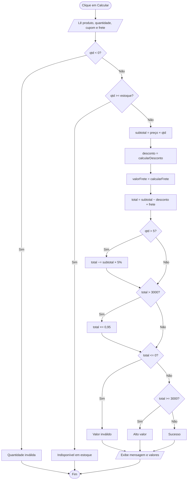
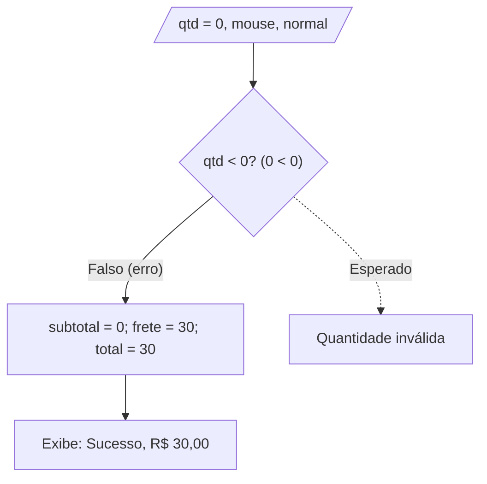
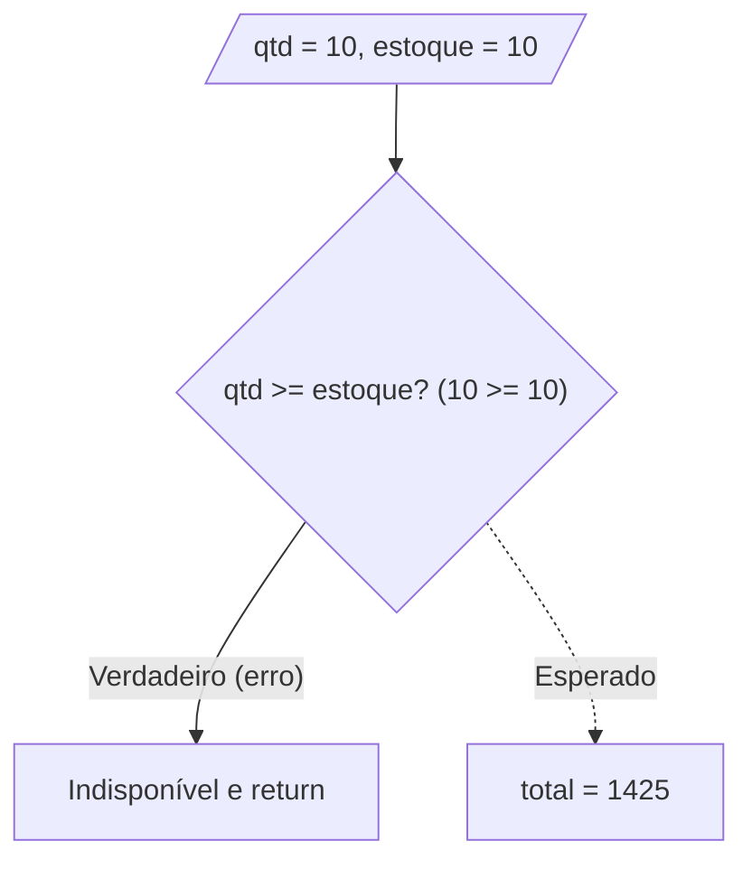
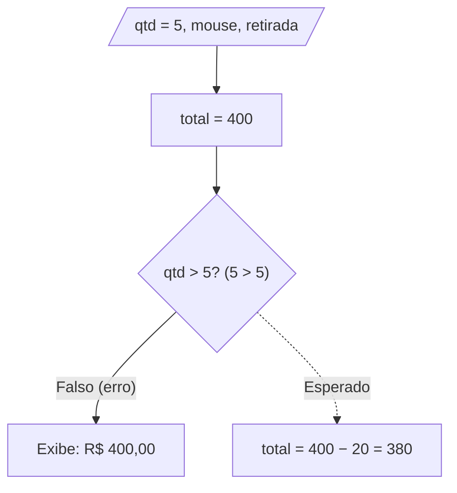
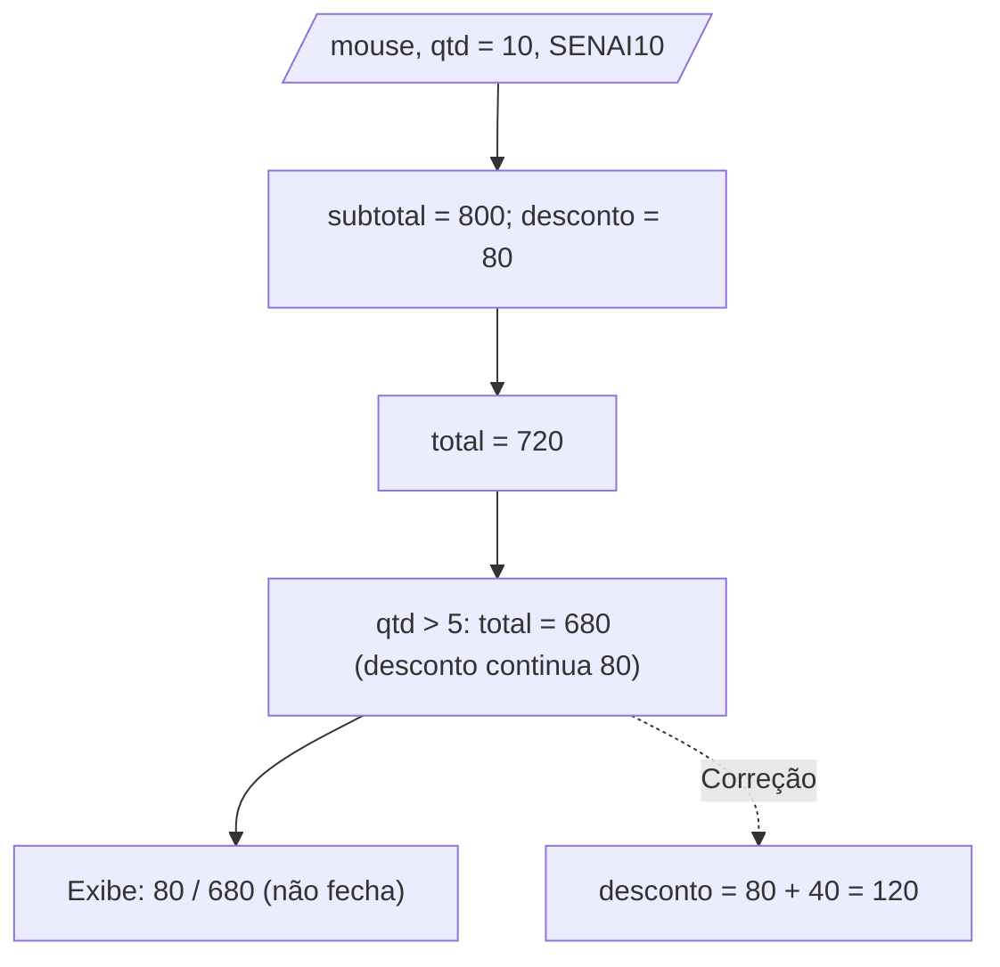
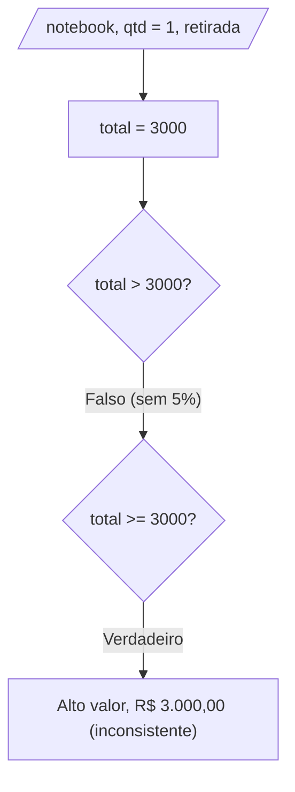
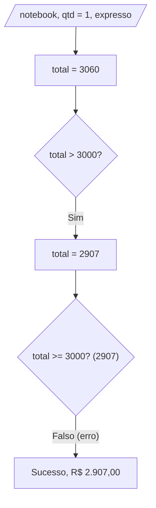

# Teste de Caixa Branca

| | |
|---|---|
| **Instituição** | SENAI |
| **Curso** | Técnico de Desenvolvimento de Sistemas |
| **Unidade curricular** | SESI CE 356 |
| **Atividade** | Teste de Caixa Branca – Sistema de Pedidos |
| **Aluno** | julianopls |
| **Turma** | 3A |
| **Professores** | Robson, Reenye e Wellington |
| **Data** | 30/09/2026 |

---

## 1. Contextualização

No teste de caixa branca eu abro o código e testo a lógica por dentro, passando por cada `if` e cada caminho possível. Isso ajuda a achar erros que só aparecem em situações específicas, como um valor exatamente no limite de uma regra.

**Sistema analisado:** uma página onde o usuário escolhe um produto, informa a quantidade, pode usar um cupom e escolhe o frete. Ao clicar em "Calcular pedido", ela mostra subtotal, desconto, frete e total. A lógica está toda no `script.js`.

**Comportamento esperado:**

| Regra | O que eu espero |
|---|---|
| Quantidade | Inteiro maior que zero |
| Estoque | Posso pedir até a quantidade em estoque, inclusive |
| Cupom `SENAI10` | 10% sobre o subtotal |
| Cupom `SENAI20` | 20% sobre o subtotal, só com subtotal a partir de R$ 1.000 |
| Desconto por quantidade | 5% sobre o subtotal a partir de 5 unidades |
| Frete | Retirada grátis; expresso R$ 60; normal R$ 30, grátis com subtotal a partir de R$ 500 |
| Alto valor | Total a partir de R$ 3.000 ganha 5% extra e a mensagem "Pedido de alto valor" |
| Exibição | Subtotal − descontos + frete deve bater com o total mostrado |

---

## 2. Estruturas de Decisão

O código só usa `if`, e o único operador lógico é o `&&` do cupom SENAI20.

| # | Onde | Condição | Caminhos |
|---|---|---|---|
| D1 | `calcularDesconto` | `codigo === "SENAI10"` | V: 10% / F: vai para D2 |
| D2 | `calcularDesconto` | `codigo === "SENAI20" && subtotal >= 1000` | V: 20% / F: sem desconto |
| D3 | `calcularFrete` | `tipo === "retirada"` | V: R$ 0 / F: vai para D4 |
| D4 | `calcularFrete` | `tipo === "expresso"` | V: R$ 60 / F: vai para D5 |
| D5 | `calcularFrete` | `subtotal >= 500` | V: R$ 0 / F: R$ 30 |
| D6 | `finalizarPedido` | `qtd < 0` | V: "Quantidade inválida" / F: D7 |
| D7 | `finalizarPedido` | `qtd >= estoque[produto]` | V: "Indisponível" / F: calcula |
| D8 | `finalizarPedido` | `qtd > 5` | V: aplica 5% / F: não aplica |
| D9 | `finalizarPedido` | `total > 3000` | V: 5% extra / F: não aplica |
| D10 | `finalizarPedido` | `total <= 0` | V: "Valor inválido" / F: D11 |
| D11 | `finalizarPedido` | `total >= 3000` | V: "Alto valor" / F: "Sucesso" |

---

## 3. Fluxograma do Sistema



---

## 4. Casos de Teste e Resultados

Criei um caso de teste para cada erro encontrado. Rodei todos em Node.js com a mesma lógica do `script.js`, antes e depois da correção.

| ID | Entrada | Esperado | Obtido (original) | Depois |
|---|---|---|---|---|
| CT01 | Mouse, qtd 0, sem cupom, normal | "Quantidade inválida" | "Sucesso", total R$ 30,00 | Passou |
| CT02 | Teclado, qtd 10 (= estoque), sem cupom, retirada | Aceito, total R$ 1.425,00 | "Indisponível em estoque" | Passou |
| CT03 | Mouse, qtd 5, sem cupom, retirada | Desconto R$ 20,00, total R$ 380,00 | Sem desconto, total R$ 400,00 | Passou |
| CT04 | Mouse, qtd 10, SENAI10, retirada | Desconto R$ 120,00, total R$ 680,00 | Desconto R$ 80,00, total R$ 680,00 | Passou |
| CT05 | Notebook, qtd 1, sem cupom, retirada | Total R$ 2.850,00, "Alto valor" | Total R$ 3.000,00, "Alto valor" (mensagem certa, total errado) | Passou |
| CT06 | Notebook, qtd 1, sem cupom, expresso | Total R$ 2.907,00, "Alto valor" | Total R$ 2.907,00, "Sucesso" (total certo, mensagem errada) | Passou |

---

## 5. Análise dos Erros

### Erro 1 — Fácil (valores-limite)

```js
if (qtd < 0) { ... }
```

**Teste:** mouse, quantidade 0, frete normal.
**Caminho:** em D6, `0 < 0` é falso, então o pedido não é barrado. O subtotal é 0, mas em D5 `0 >= 500` é falso e o frete fica 30. O total vira 30 e o resultado é "Sucesso".
**Problema:** o zero, primeiro valor inválido, passa. Campo vazio e decimais também passam. O cliente pagaria frete por zero itens.
**Correção:**
```js
if (!Number.isInteger(qtd) || qtd <= 0) {
```



### Erro 2 — Fácil (valores-limite)

```js
if (qtd >= estoque[produtoSelecionado]) { ... }
```

**Teste:** teclado (estoque 10), quantidade 10, retirada.
**Caminho:** em D7, `10 >= 10` é verdadeiro, então mostra "indisponível" e encerra com `return`.
**Problema:** o `>=` bloqueia justamente o pedido que usa todo o estoque. O notebook (estoque 5) nunca poderia ser comprado em 5 unidades.
**Correção:**
```js
if (qtd > estoque[produtoSelecionado]) {
```
Também testei quantidade 11, que continua sendo recusada.



### Erro 3 — Médio (valores-limite e cobertura de decisões)

```js
if (qtd > 5) { total = total - subtotal * 0.05; }
```

**Teste:** mouse, quantidade 5, retirada.
**Caminho:** subtotal 400, frete 0, total 400. Em D8, `5 > 5` é falso, então o desconto não é aplicado.
**Problema:** o `>` deixa de fora exatamente a quantidade que abre a faixa. O certo é `>=`.
**Correção:**
```js
const QTD_MINIMA_DESCONTO = 5;
if (qtd >= QTD_MINIMA_DESCONTO) { desconto += subtotal * 0.05; }
```
Com 5 unidades o total passa a ser R$ 380,00, e com 4 continua sem desconto.



### Erro 4 — Médio (rastreamento de variáveis)

```js
const desconto = calcularDesconto(subtotal, codigo);
let total = subtotal - desconto + valorFrete;
if (qtd > 5) { total = total - subtotal * 0.05; }
```

**Teste:** mouse, quantidade 10, cupom SENAI10, retirada.
**Caminho:** subtotal 800; cupom dá `desconto` = 80; total = 720. Em D8, o total vira 720 − 40 = 680, mas `desconto` continua valendo **80**.
**Problema:** o desconto por quantidade mexe direto em `total` e nunca entra na variável `desconto`. Na tela aparece 800 − 80 ≠ 680, e um desconto do cliente fica escondido.
**Correção:** somar os dois descontos na mesma variável (`let desconto` + `desconto += subtotal * 0.05`), como no código final. A tela passa a mostrar desconto R$ 120,00 e total R$ 680,00.



### Erro 5 — Difícil (condições que dependem uma da outra)

```js
if (total > 3000) { total = total * 0.95; }
...
else if (total >= 3000) { mensagem = "Pedido de alto valor."; }
```

**Teste:** notebook, quantidade 1, retirada (total exatamente 3000).
**Caminho:** em D9, `3000 > 3000` é falso, então não há 5% extra. Em D11, `3000 >= 3000` é verdadeiro e a mensagem é "Alto valor".
**Problema:** duas decisões testam o mesmo limite com operadores diferentes. O pedido é chamado de alto valor, mas não ganha o benefício. O erro só aparece exatamente em 3000.
**Correção:** uma constante única e a mesma comparação nos dois lugares:
```js
const LIMITE_ALTO_VALOR = 3000;
const altoValor = totalParcial >= LIMITE_ALTO_VALOR;
```
Resultado: total R$ 2.850,00 e "Pedido de alto valor".



### Erro 6 — Difícil (análise de caminhos e rastreamento de variáveis)

**Teste:** notebook, quantidade 1, frete expresso.
**Caminho:** total = 3000 + 60 = 3060. Em D9, `3060 > 3000` é verdadeiro e o total vira 2907. Em D11, `2907 >= 3000` é falso e a mensagem sai "Sucesso".
**Problema:** ordem das operações. O desconto extra reduz `total` e logo depois a mesma variável classifica o pedido. Qualquer pedido entre R$ 3.000,00 e cerca de R$ 3.157,89 perde a classificação. Uma decisão altera o dado que a próxima usa.
**Correção:** decidir se é alto valor antes de mexer no total:
```js
const altoValor = totalParcial >= LIMITE_ALTO_VALOR;
const descontoAltoValor = altoValor ? totalParcial * 0.05 : 0;
const total = totalParcial - descontoAltoValor;
```
Resultado: "Pedido de alto valor." e total R$ 2.907,00.



### Resumo antes e depois

| Erro | Nível | Antes | Depois |
|---|---|---|---|
| 1 | Fácil | Aceita quantidade 0 e cobra frete | Recusa 0, vazio e decimais |
| 2 | Fácil | Bloqueia pedido igual ao estoque | Aceita até o estoque |
| 3 | Médio | 5 unidades sem desconto | Desconto a partir de 5 |
| 4 | Médio | Desconto mostrado não fecha com o total | Desconto soma cupom e quantidade |
| 5 | Difícil | `>` e `>=` divergem em 3000 | Mesmo limite nas duas decisões |
| 6 | Difícil | Perde "alto valor" após o desconto | Classificação decidida antes |

### Cobertura

Os seis casos cobrem os dois lados de D1, D3, D4, D6, D7, D8, D9 e D11, além do lado falso de D2 e de D10. Ainda faltam o lado verdadeiro de D2 (SENAI20 com subtotal a partir de R$ 1.000) e o lado verdadeiro de D5 (frete normal com subtotal a partir de R$ 500). Também vale testar SENAI20 abaixo de R$ 1.000 e um cupom inexistente.

---

## 6. Código Corrigido

O arquivo completo está em [`scriptnovo.js`](./scriptnovo.js). Função `finalizarPedido` corrigida:

```js
const LIMITE_ALTO_VALOR = 3000;
const QTD_MINIMA_DESCONTO = 5;

function finalizarPedido() {
  const produtoSelecionado = produto.value;
  const qtd = Number(quantidade.value);
  const codigo = cupom.value.trim().toUpperCase();

  if (!Number.isInteger(qtd) || qtd <= 0) {
    resultado.innerHTML = "<p>Quantidade inválida.</p>";
    return;
  }

  if (qtd > estoque[produtoSelecionado]) {
    resultado.innerHTML = "<p>Quantidade indisponível em estoque.</p>";
    return;
  }

  const subtotal = precos[produtoSelecionado] * qtd;
  let desconto = calcularDesconto(subtotal, codigo);

  if (qtd >= QTD_MINIMA_DESCONTO) {
    desconto += subtotal * 0.05;
  }

  const valorFrete = calcularFrete(frete.value, subtotal);
  const totalParcial = subtotal - desconto + valorFrete;

  const altoValor = totalParcial >= LIMITE_ALTO_VALOR;
  const descontoAltoValor = altoValor ? totalParcial * 0.05 : 0;
  const total = totalParcial - descontoAltoValor;

  let mensagem = "Pedido calculado com sucesso.";

  if (total <= 0) {
    mensagem = "Valor do pedido inválido.";
  } else if (altoValor) {
    mensagem = "Pedido de alto valor.";
  }

  resultado.innerHTML = `
    <p>${mensagem}</p>
    <p>Subtotal: R$ ${subtotal.toFixed(2)}</p>
    <p>Desconto: R$ ${desconto.toFixed(2)}</p>
    ${altoValor ? `<p>Desconto alto valor: R$ ${descontoAltoValor.toFixed(2)}</p>` : ""}
    <p>Frete: R$ ${valorFrete.toFixed(2)}</p>
    <p class="total">Total: R$ ${total.toFixed(2)}</p>
  `;
}
```

---